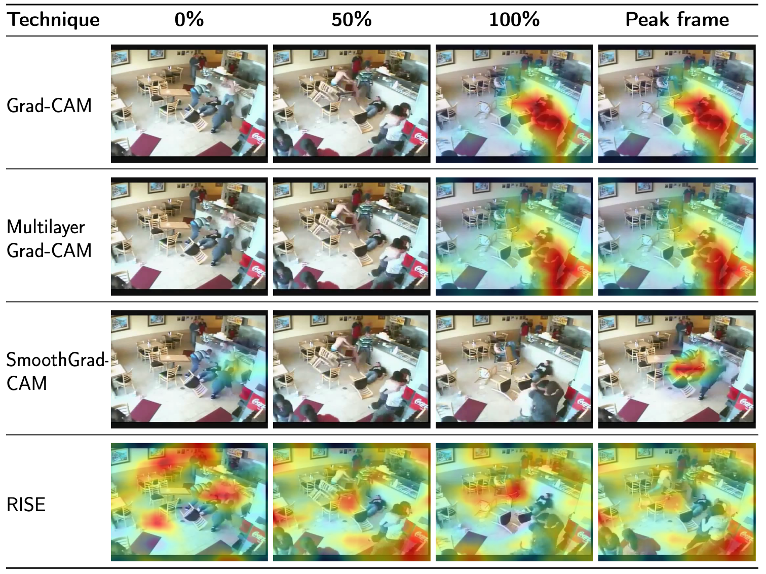
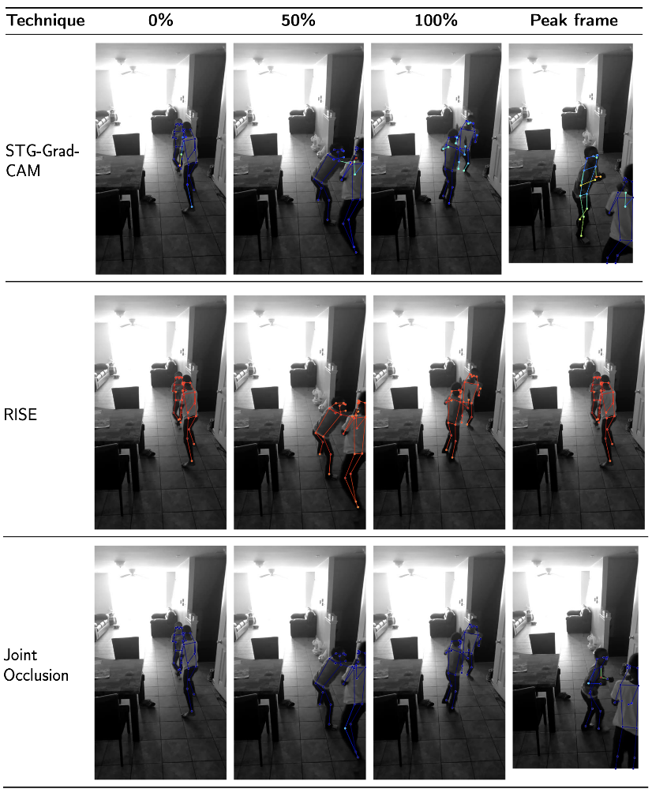
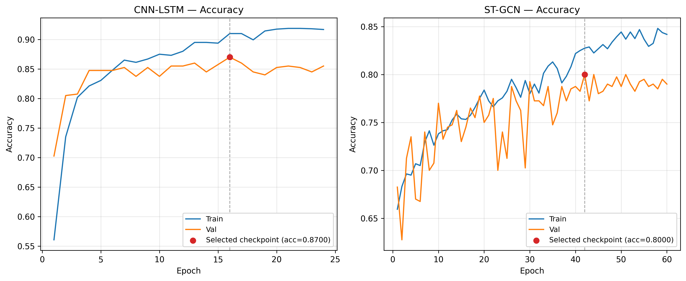

# Explainable AI for Violence Detection

This project evaluates explainable artificial intelligence (XAI) techniques for video-based violence detection. Two deep learning models were developed using different input representations: a CNN-LSTM operating on RGB frame differences and an ST-GCN operating on estimated human skeletal keypoints. Gradient- and perturbation-based XAI techniques were then implemented and evaluated using measures of faithfulness, stability, and computational efficiency.

## Dataset

The project uses the [**RWF-2000**](https://github.com/mchengny/RWF2000-Video-Database-for-Violence-Detection) dataset, a real-world video dataset for violence detection collected entirely from CCTV footage.

- **2,000 videos** in total
- **1,000 Fight** and **1,000 Non-Fight** videos
- **1,600 training videos** (800 Fight / 800 Non-Fight)
- **400 validation videos** (200 Fight / 200 Non-Fight)
- Each video is **5 seconds long**
- Each video contains **150 frames at 30 FPS**
- Videos contain a range of scenes, viewpoints, lighting conditions, and resolutions

  
  

## Models

Two models with fundamentally different input representations were implemented to evaluate XAI techniques across both image-based and comparatively underexplored skeleton-based violence detection. 

### CNN-LSTM

The CNN-LSTM detects violence from sequences of RGB frame differences. The pre-trained MobileNetV2 CNN backbone extracts spatial feature maps from each frame in the clip, which are then fed sequentially into a SepConvLSTM to extract spatiotemporal features before classification. 

1. 33 frames are uniformly sampled from the original 150-frame video. As consecutive frames typically contain redundant information (as they are very similar), temporal sampling reduces the amount of data processed while retaining information across the full video.

2. The frames were resized to 224 X 224 and augmentations including random cropping, horizontal flipping, random contrast, random brightness, and Gaussian blurring were applied during training to improve generalisation. 

3. The 33 sampled frames are differenced to obtain 32 frame differences. Frame differencing highlights motion between consecutive frames while suppressing static background information.

4. The 32 frame differences are passed independently through a pre-trained MobileNetV2 CNN backbone to extract a spatial feature map from each frame difference.

5. The spatial feature maps are fed sequentially into a SepConvLSTM to extract spatiotemporal features. Unlike a conventional LSTM, it uses convolutional operations, which preserve the spatial structure of the feature maps. Depthwise separable convolutions reduce parameter count and computational cost.

6. The final SepConvLSTM output is pooled and passed through a fully connected classification layer to produce the final Fight or Non-Fight prediction.

### ST-GCN
The Spatial-Temporal Graph Convolutional Network (ST-GCN) detects violence from sequences of human skeletal keypoints. Human poses are estimated and tracked across each video before the ST-GCN learns spatial and temporal patterns from dynamic skeletal data to predict violence.

1. Human poses are estimated in each video frame using a pre-trained pose estimation model from Ultralytics. 17 skeletal keypoints are detected for each person, with consistent identities maintained across frames.

2. The pose data is converted into a fixed-size tensor containing the X and Y coordinates and confidence score of each joint across all 150 frames. Up to 4 people are represented.

3. The X and Y coordinates are normalised relative to the video's resolution. During training, skeleton-specific augmentations including frame occlusion, interpolation, keypoint swapping, and mirroring are applied to improve generalisation and robustness to pose estimation errors.

4. Each skeleton is represented as a spatiotemporal graph. Human joints are modelled as graph nodes with spatial edges corresponding to anatomical connections, and temporal edges connecting joints between
consecutive frames. Graph convolutions are then performed over this spatiotemporal graph to extract spatiotemporal features.

5. The spatiotemporal graphs are passed through 10 ST-GCN units. Each unit applies spatial and temporal convolutions.

6. Global average pooling produces a feature vector for each tracked person. Features from non-empty tracks are averaged to form a single video representation, which is then passed through the final classification layer to produce the Fight or Non-Fight prediction.

## Explainable AI Techniques

Gradient- and perturbation-based XAI techniques were implemented to generate saliency maps highlighting the input features most influential to each model's prediction. Where applicable, the techniques were adapted to the different input representations of the CNN-LSTM and ST-GCN.

### Grad-CAM
The technique computes the gradient of the target-class prediction (Fight or Non-Fight) with respect to the feature maps of the last convolutional layer. These gradients are used to calculate an importance weight for each feature map in the layer's output. The gradient-weighted sum of the feature maps produces the saliency map.

### Multilayer Grad-CAM
This technique applied the Grad-CAM formulation to multiple layers in the CNN, not just the last one. The saliency maps at each convolutional layer were combined using an unweighted average. 

### SmoothGrad-CAM

This technique applies the same Grad-CAM formulation but computes the final saliency map by averaging Grad-CAM saliency maps generated from multiple noisy versions of the input. This aims to reduce noise and produce more stable explanations.

### RISE
The method works by randomly masking parts of the input and observing how the output changes. Regions whose removal results in lower prediction confidence are considered more important. The final saliency map is produced by weighting and aggregating the random masks according to the model's prediction confidence.

### Occlusion Sensitivity

Similar to RISE, this method works by masking parts of the input and observing how the output changes. Instead of applying many random masks, it systematically masks predefined regions of the input. This was applied to ST-GCN where individual joints were systematiclly occluded across a small temporal window.

  <strong>CNN-LSTM saliency maps example</strong>
    
  
     
  <strong>ST-GCN saliency maps example</strong>
    
  

## Classification Performance

The CNN-LSTM and ST-GCN models were evaluated on the RWF-2000 validation set, consisting of 400 videos.

| Model | Validation Accuracy | Recall (Fight) |
|---|---:|---:|
| CNN-LSTM | 87% | 84.5% |
| ST-GCN | 80% | 92.5% |

The training and validation accuracy curves for both models are shown below.

  

## XAI quantitative results

Each XAI technique were quantitatively evaluated using measures of:

- **Faithfulness** - How accurately the saliency maps reflect the features influencing model predictions.
- **Stability** - How consistent the saliency maps are when the input is slightly perturbed.
- **Computational efficiency** - The time taken to produce the saliency map. 

  <strong>CNN-LSTM XAI results</strong>
    
  
     
  <strong>ST-GCN XAI results</strong>
    
  

