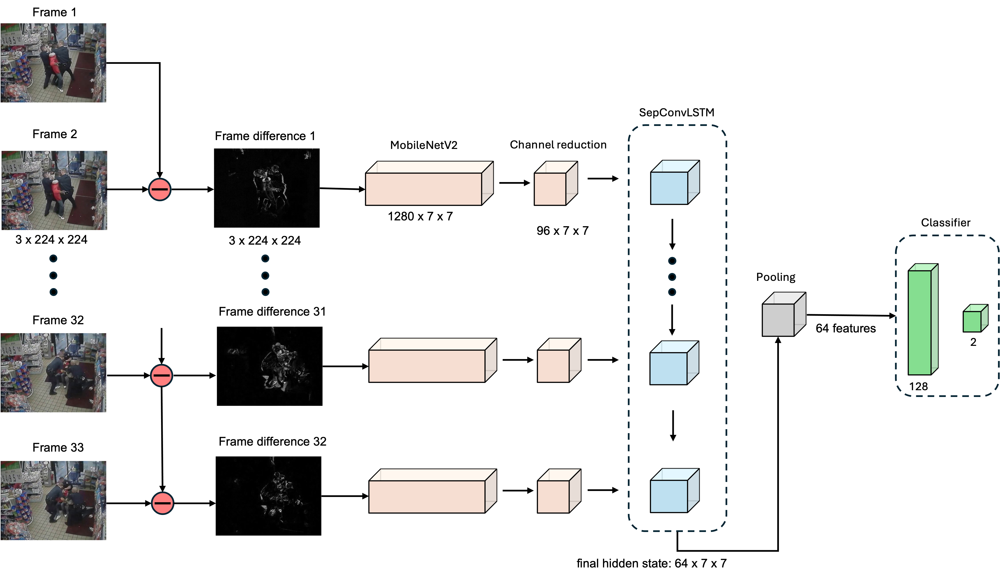
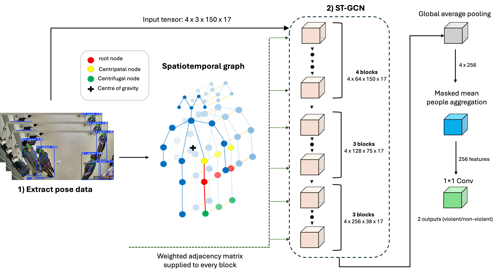

# Explainable AI for Violence Detection

This project evaluates explainable artificial intelligence (XAI) techniques for video-based violence detection. Two deep learning models were developed using different input representations: a CNN-LSTM operating on RGB frame differences and an ST-GCN operating on estimated human skeletal keypoints. Gradient- and perturbation-based XAI techniques were then implemented and evaluated using measures of faithfulness, stability, and computational efficiency.

## Dataset

The project uses the [**RWF-2000**](https://github.com/mchengny/RWF2000-Video-Database-for-Violence-Detection) dataset, a real-world video dataset for violence detection collected entirely from CCTV footage.

- **2,000 videos** in total
- **1,000 Fight** and **1,000 Non-Fight** videos
- **1,600 training videos** (800 Fight / 800 Non-Fight)
- **400 validation videos** (200 Fight / 200 Non-Fight)
- Each video is **5 seconds long**
- Each video contains **150 frames at 30 FPS**
- Videos contain a range of scenes, viewpoints, lighting conditions, and resolutions

  
  

## Models

### CNN-LSTM

### ST-GCN

## Explainable AI Methods

